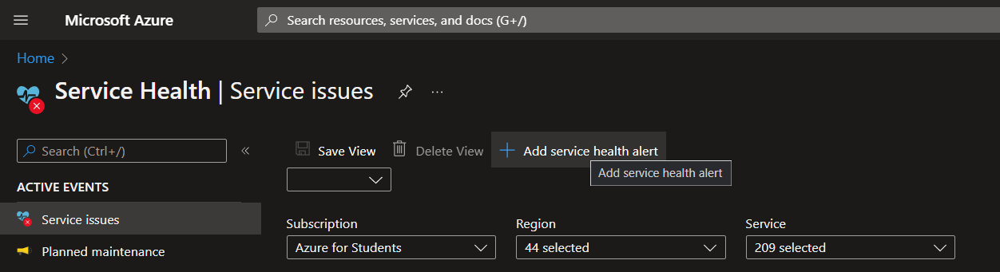
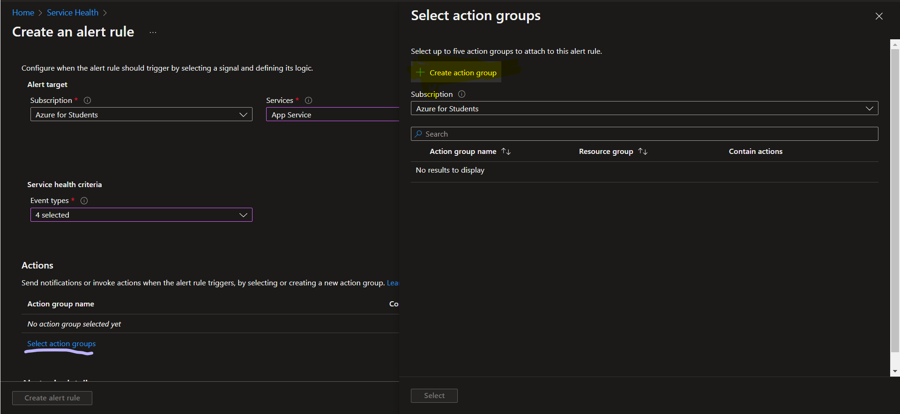
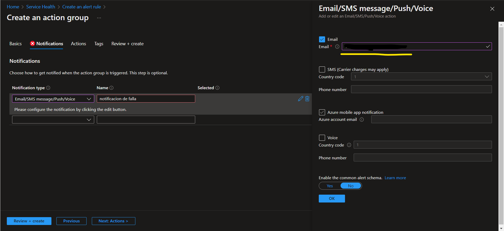
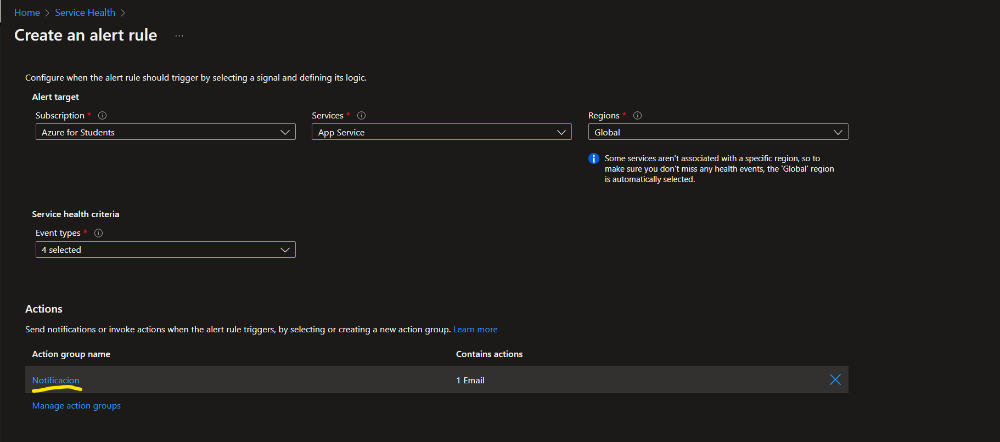
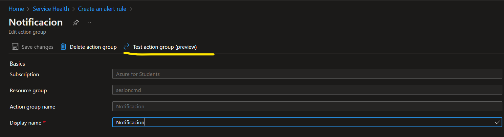
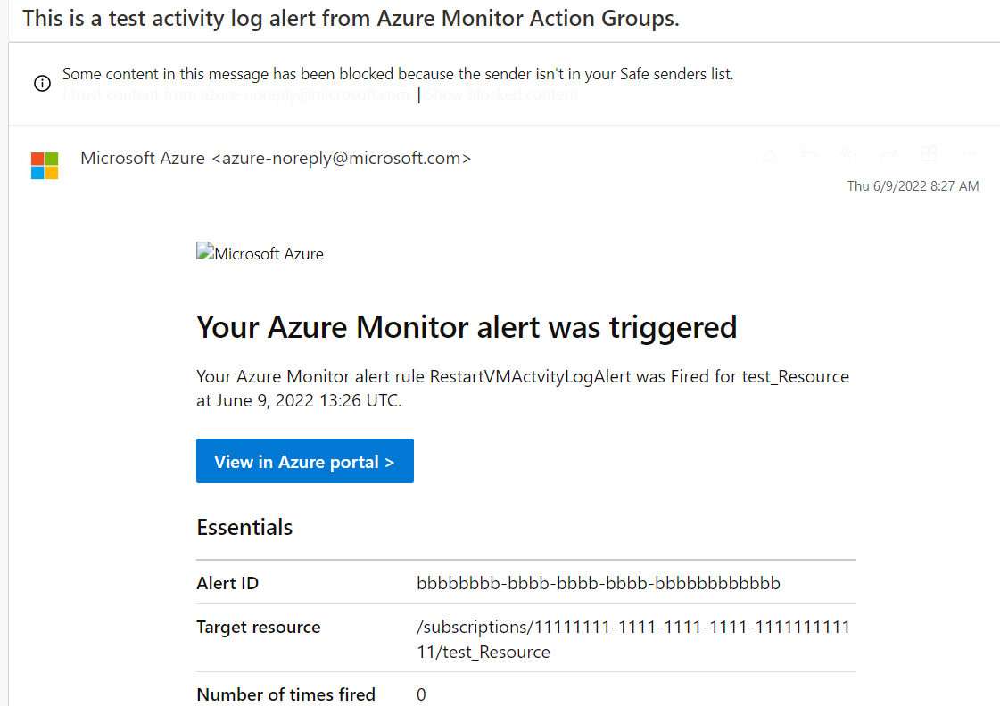
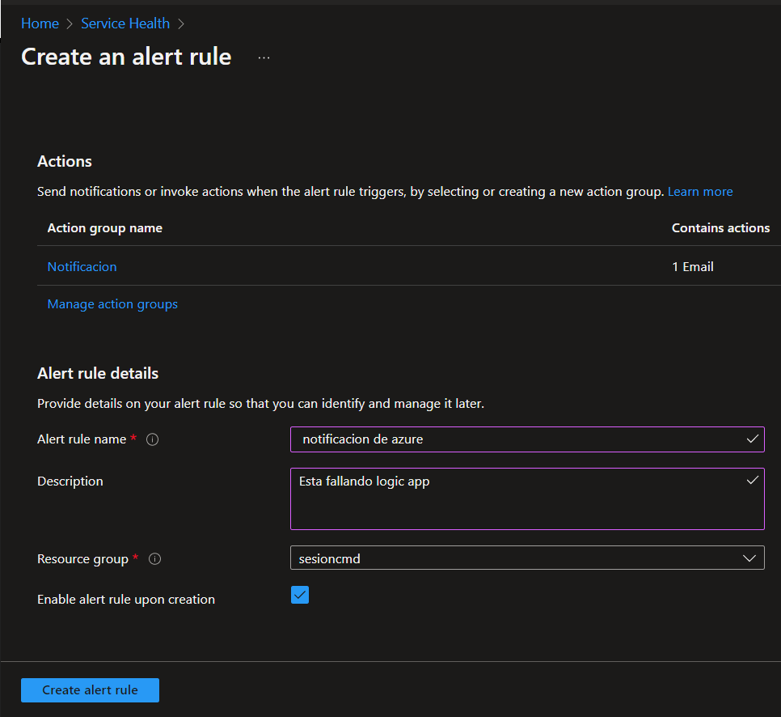

# Se aprendera como activar una alerta en Azure Service Healt

- Primero debemos abrir la pagina de [Azure](https://portal.azure.com/#home) y buscaremos "Service Health" y clickearemos en "agregar alertas"

- Llenaremos todos los campos y clickearemos en "seleccionar gupo de acciones" y crearemos una alerta

Deberemos escojer que debe de hacer Azure cuando tenga la falla por lo que deberemos escojer si nos enviara un msj o correo, escojeremos y daremos en ok y crear

Si queremos testear que realizamos bien la alerta podremos ir a notificaciones dentro de la alerta

Y daremo click en testear

Escojeremos el tipo de notificacion que queremos que nos llegue a nuestro correo y daremos click en ok
Ahora nos dirigiremos  a nuestro correo para confirmar que la alerta se genero con exito

Una ves que estemos seguros que la alerta fue creada con exito regresaremos a la pagina de Azure para terminar de configurar nuestra alerta 

Lenaremos todos los espacios y daremos en crear alerta 

#### Y listo ya creaste una alerta en Azure :) 